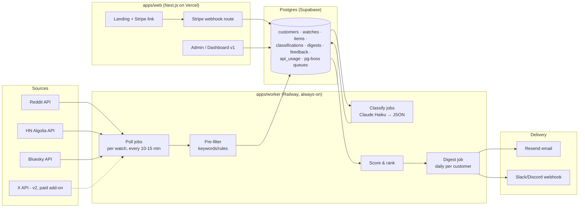

# Community Intent-Lead Tool — System Architecture & Build Plan

**For:** Shaquille · SASS project · September 2026
**Product (working name):** intent-lead digest for SaaS founders — monitors Reddit/HN/Bluesky for buying-intent posts matching a customer's ICP, classifies them with Claude, and delivers a daily "hot leads" digest with suggested reply angles.
**Strategy constraint this design serves:** sellable as a concierge service by day 3, without rearchitecting when it becomes self-serve SaaS in weeks 2–4. The way you get both: **build the data pipeline multi-tenant from day one, keep the interface concierge** (you edit config rows and run CLI commands; customers only see the digest). Graduating to SaaS later means adding auth + a dashboard on top — not rewriting the engine.

---

## 1. Framework verdict (your Next.js + Express question)

**Next.js — keep it.** It carries the landing page, the payment flow, the Stripe webhook route, and eventually the dashboard. App Router + server components + server actions means your dashboard CRUD talks straight to the database without a separate API layer. Deploy on Vercel.

**Express — right instinct, wrong shape for this system.** The reflex "Next.js frontend + Express backend" assumes the backend's job is serving HTTP. Here it isn't: the heart of this product is a **long-running background pipeline** (pollers on schedules, batch classification, digest sends). That wants a plain Node/TypeScript **worker process** driven by a job queue — no HTTP framework required at all, except maybe a one-line health endpoint. If you bolt the pipeline onto an Express server you'll fight request/response thinking (timeouts, statelessness) for a workload that is fundamentally cron + queue.

So the recommended split is:

| Layer | Choice | Why over the alternative |
|---|---|---|
| Web (landing, dashboard, webhooks) | **Next.js 15, App Router** | You know it; server actions kill the need for a REST API in v1 |
| Pipeline | **Plain TS worker + pg-boss** | pg-boss gives queues, cron, retries, and singleton jobs **inside Postgres** — no Redis, one less piece of infra than BullMQ |
| Worker HTTP (health/admin, if wanted) | **Hono** (or keep Express) | Hono is TS-first, tiny, and pleasant; but this is ~30 lines either way — if Express familiarity is faster for you, Express is fine here. What matters is that it's incidental, not the architecture |
| Database | **Postgres via Supabase** (Neon also fine) | Multi-tenant from day 1; Supabase bundles Studio (your concierge admin UI for free) and Auth (used in v1, ignored in MVP) |
| ORM | **Drizzle** | Lightweight, SQL-shaped, great TS inference; pairs with pg-boss sharing the same connection |
| Validation | **Zod** | One schema language for env vars, adapter payloads, LLM outputs, and forms |
| LLM | **Anthropic TS SDK — Haiku for classification**, Sonnet as escalation tier | Classification is high-volume/low-difficulty; see §5 cost math |
| Email | **Resend + React Email** | Digest templates in JSX, lives happily in the monorepo |
| Payments | **Stripe Payment Link (MVP) → Stripe Billing + webhooks (v1)** | Zero code to start charging on day 1 |
| Hosting | **Vercel (web) + Railway (worker)** | Railway runs the always-on worker with cron-friendly logs; alternatively run both on Railway if you'd rather have one dashboard |
| Monorepo | **pnpm workspaces + Turborepo** | Web and worker share `packages/core` (adapters, classifier, types) and `packages/db` |

Explicitly **not** in this build: NestJS (ceremony you don't need), Redis/BullMQ (pg-boss covers it at this scale), microservices, embeddings/vector DB (keyword pre-filter + LLM is enough until you have data proving otherwise), Kubernetes, tRPC (server actions cover it).

---

## 2. System topology



Data flows one direction through five stages, each with a typed contract:

```
RawItem → NormalizedItem → (pre-filter) → ClassifiedItem → ScoredLead → DigestEntry
```

Every stage writes to Postgres before the next reads, so any stage can crash, retry, or be re-run idempotently without losing or duplicating work. That single property is what makes a solo-maintained pipeline survivable.

---

## 3. Repository layout

```
intent-tool/
├─ apps/
│  ├─ web/                          # Next.js 15
│  │  ├─ app/(marketing)/page.tsx   # landing + pricing
│  │  ├─ app/api/stripe/webhook/route.ts
│  │  ├─ app/admin/                 # v1: gated ops pages (skip in MVP)
│  │  └─ app/(app)/dashboard/       # v1: customer dashboard
│  └─ worker/
│     ├─ src/index.ts               # boot: connect pg-boss, register jobs, schedules
│     ├─ src/jobs/poll.ts           # one execution = one watch × one source
│     ├─ src/jobs/classify.ts       # drains unclassified items in batches
│     ├─ src/jobs/digest.ts         # daily per customer
│     ├─ src/http.ts                # health endpoint (Hono/Express, ~30 lines)
│     └─ src/cli.ts                 # manual ops: seed, run-now, backfill, eval
├─ packages/
│  ├─ core/
│  │  ├─ adapters/                  # reddit.ts · hn.ts · bluesky.ts · rss.ts · x.ts
│  │  ├─ adapters/types.ts          # SourceAdapter interface + Zod schemas
│  │  ├─ filter/rules.ts            # keyword include/exclude engine
│  │  ├─ classify/prompt.ts         # rubric + per-customer profile block
│  │  ├─ classify/schema.ts         # Zod schema for the LLM's JSON output
│  │  ├─ classify/evals/            # golden set + eval runner (§5)
│  │  ├─ scoring.ts
│  │  └─ digest/                    # render.tsx (React Email) · slack.ts
│  └─ db/
│     ├─ schema.ts                  # Drizzle schema (single source of truth)
│     ├─ client.ts
│     └─ migrations/
├─ .env.example
├─ turbo.json
└─ pnpm-workspace.yaml
```

The strategic point of `packages/core`: the web app renders the *same* digest components and reads the *same* lead types the worker produces, so the v1 dashboard is mostly UI work, not logic work.

---

## 4. Component deep-dives

### 4.1 Source adapters (ingestion)

One interface, many sources — this is the seam that lets you add or drop platforms without touching the pipeline:

```ts
interface SourceAdapter {
  source: "reddit" | "hn" | "bluesky" | "rss" | "x";
  fetchNew(watch: WatchConfig, cursor: Cursor | null): Promise<{
    items: RawItem[];        // Zod-validated at the boundary
    nextCursor: Cursor;      // last-seen id/timestamp, persisted per (watch, source)
  }>;
}
```

**Reddit** (primary source): OAuth2 client-credentials "script" app; poll `/r/{sub}/new.json` per watched subreddit plus `/search.json` for keyword queries. Two hard rules baked into the adapter: a **global token-bucket rate limiter** shared across all customers (stay well under the ~100 queries/min free-tier ceiling — budget ~60/min), and exponential backoff on 429s with the job rescheduling itself rather than hammering. Cursor = newest fullname (`t3_*`) seen per subreddit. Design every watch to be narrow (5–15 subreddits), which keeps you inside the free tier per the pricing reality documented in the research report; file Reddit's commercial-use approval request in week 1 since reviews reportedly take 2–4 weeks.

**Hacker News**: the Algolia HN Search API — free, no auth, generous. Query by keywords with `numericFilters=created_at_i>{cursor}`. Cheapest incremental value in the whole system; build it second because it makes every digest thicker for zero marginal cost.

**Bluesky**: `app.bsky.feed.searchPosts` with an app-password session. Free. Growing founder/dev population.

**RSS (generic)**: many niche forums (Discourse-based ones especially) expose RSS/JSON feeds; a generic adapter here future-proofs you for "monitor this forum for me" requests, which founding customers *will* ask for.

**X (deferred, priced add-on)**: pay-per-use API at ~$0.005/post read means a keyword monitor costs $20–30/mo per customer — only build it when it's a paid tier (e.g., +$29/mo), and meter reads per customer with a hard cap in `api_usage`. Not in the MVP.

**Explicitly skipped**: LinkedIn (no viable API; scraping violates ToS), auto-posting replies anywhere (instant Reddit ban and a trust-destroyer — the product drafts reply angles, the human sends them).

Adapter-layer invariants: all items are **upserted with a unique index on `(source, external_id)`** so re-polls and retries are idempotent; every fetch logs to `api_usage` (customer_id, source, calls, tokens) because per-customer unit economics is a first-class feature of the system, not an afterthought.

### 4.2 Pre-filter (the cost firewall)

Before anything touches an LLM, a dumb-fast rules pass drops 80–90% of fetched items: per-watch `include_terms` (OR-matched, stemmed-ish via lowercase + word boundaries), `exclude_terms` (kills job posts, memes, "[hiring]"), minimum body length, language check, and venue weights. This stage is pure functions in `packages/core/filter` — unit-test it hard, because every false *negative* here is an invisible lost lead. When in doubt, let it through: Haiku classification costs ~$0.001/item; a missed lead costs trust.

### 4.3 Intent classification (the product's actual moat)

A single Claude call per batch of items, structured as: **cached system rubric** (same for all customers — use prompt caching), a **per-customer profile block** (their product description, ICP, competitors, disqualifiers — this is why classification quality beats generic keyword tools), 3–5 **few-shot examples harvested from that customer's feedback**, then N items. Output is forced through a tool-use JSON schema, Zod-validated:

```ts
{
  item_id: string,
  relevant: boolean,
  intent: "buying_intent" | "pain_point" | "competitor_complaint"
        | "question" | "none",
  score: number,          // 0–100
  reason: string,         // one sentence, shown in the digest
  reply_angle: string     // suggested angle, not a canned reply
}
```

Model strategy: **Haiku classifies everything**; items landing in the ambiguous 40–70 score band get a second look from **Sonnet** (a cascade — you pay the bigger model only for the hard 10%). Customers on daily-digest-only plans can run through the **Batch API at 50% discount** overnight. Every call's token counts land in `api_usage`.

Quality loop (do not skip): build a **golden set** — ~50 real posts you hand-label per niche in an evals folder — and a `pnpm eval` runner that reports precision/recall against it. Run it every time the rubric changes. Digest emails carry 👍/👎 links per lead (a signed URL hitting a Next.js route) writing to `feedback`, which feeds the few-shots. Precision@top-20 is the metric that decides whether customers stay.

### 4.4 Scoring & ranking

Final rank = LLM score, boosted by recency decay (half-life ~24h), venue weight, and engagement velocity (upvotes/comments since fetch — re-read cheaply at digest time for the top candidates only). Near-duplicate collapse (same author cross-posting to 3 subreddits = one lead, three links). Pure functions, unit-tested, no I/O.

### 4.5 Digest generation & delivery

A daily pg-boss cron job per customer at their local send hour (store an IANA timezone per customer; compute send time in UTC at schedule creation). The digest: top 5–15 leads grouped by intent type, each with title/snippet, link, "why it matters" (the `reason` field), the reply angle, and feedback links. Rendered once from React Email components, delivered through **Resend** (email) and/or a **Slack/Discord incoming webhook** (Block Kit / embed variants of the same data — no Slack OAuth app in MVP, a webhook URL pasted by the customer is enough).

Degradation policy (decide it now, not during an outage): if a source failed, the digest still sends with a "Reddit data delayed today" note; if the classifier failed, send a keyword-only digest flagged as degraded. **Silence is the only unacceptable failure mode** for a product whose whole promise is "you won't miss leads."

### 4.6 Config & customer management

Tables drive everything (§6). In the concierge phase there is no settings UI: you edit rows in Supabase Studio or via `cli.ts seed` scripts, and onboard customers with a Tally/Google form whose answers you paste into a `profiles` row. The v1 self-serve replacement for that form is one of the best Claude use-cases in the product: an onboarding wizard where the customer describes their product in a paragraph and Claude proposes keywords + subreddits + exclusions, which the customer edits and confirms — writing the same rows your CLI writes today.

### 4.7 Web app (Next.js)

MVP scope, one day of work: a landing page (problem → sample digest screenshot → founding price → Stripe Payment Link), a thank-you page pointing to the onboarding form, and `/api/stripe/webhook` recording `checkout.session.completed` into `customers` (even while Payment Links handle checkout UI, capture the event so provisioning is a DB row from day 1). v1 additions: Supabase Auth (magic link), a leads-feed dashboard (server components reading the same tables), watch/config editor, billing portal link, and the admin pages replacing your CLI.

### 4.8 Billing

Day 1: two Payment Links — $49/mo founding and $199/yr founding — with `client_reference_id` linking to the onboarding form. v1: Stripe Checkout + Customer Portal + webhooks (`customer.subscription.updated/deleted`) flipping `customers.status`, with plan limits enforced in the worker (max watches, venues, classification volume/day) read from a `plans` map in code, not scattered ifs.

### 4.9 Ops & observability

Structured JSON logs (pino) from the worker; a #ops Slack webhook that receives job failures and daily pipeline stats (items fetched/classified, digests sent, cost per customer); pg-boss's built-in retry/dead-letter handling with `retryLimit: 3, retryBackoff: true`; a `/healthz` endpoint Railway pings; Sentry on both apps when you have paying customers (not before). One metric on a wall: **leads delivered per customer per day, and 👍 rate.**

### 4.10 Compliance & risk (the GummySearch lesson)

The incumbent died of API licensing. Bake the defenses in: per-source rate budgets enforced in code; Reddit commercial approval application submitted in week 1; store only public content plus customer emails (delete-on-request is a `DELETE ... WHERE customer_id` — keep it that simple); never auto-post; venue diversity (HN/Bluesky/RSS) so no single platform's policy change kills the product; and per-customer cost telemetry so you can see a pricing-model attack on your margins the week it happens.

---

## 5. Unit economics (why Haiku + pre-filter)

Per customer per day, at typical scope (10 subreddits + HN + Bluesky keywords): ~400–800 items fetched → ~80–150 survive the pre-filter → classified by Haiku at roughly 800 input + 150 output tokens each ≈ 100K in / 20K out per day ≈ **$0.10–0.25/day ≈ $3–8/customer/month** in LLM spend, plus near-zero API costs while inside free tiers. Against $49/mo pricing that's an 85%+ gross margin, and the `api_usage` table proves it per customer. The pre-filter and the Haiku-first cascade are what hold that line; without them the same pipeline on a big model with no filter is 20–40x the cost for marginal quality gain on this task.

## 6. Database schema (Drizzle, Postgres)

```ts
customers        id · email · name · status(enum: lead|active|churned)
                 · stripe_customer_id · plan · tz · created_at
profiles         customer_id → product_desc · icp_desc · competitors[]
                 · disqualifiers · few_shot_examples jsonb
watches          id · customer_id · name · sources[] · subreddits[]
                 · include_terms[] · exclude_terms[] · active
cursors          watch_id · source · cursor jsonb · updated_at   (PK: watch_id+source)
items            id · source · external_id · url · author · title · body
                 · venue · posted_at · fetched_at · engagement jsonb
                 · UNIQUE(source, external_id)
item_watches     item_id · watch_id            (an item can match several watches)
classifications  item_id · watch_id · relevant · intent · score
                 · reason · reply_angle · model · tokens_in/out · created_at
digests          id · customer_id · sent_at · channel · item_count · degraded bool
digest_items     digest_id · item_id · rank
feedback         customer_id · item_id · verdict(up|down) · created_at
api_usage        id · customer_id? · source · calls · tokens_in/out · cost_usd · day
```

pg-boss creates its own schema for queues. Everything customer-facing hangs off `customer_id` — that's the multi-tenancy. Row-level security only becomes relevant in v1 if the dashboard reads via Supabase's client SDK; with server components reading through Drizzle, plain WHERE clauses gated by the session suffice.

## 7. Job choreography (pg-boss)

```
poll:{watch_id}:{source}     every 10–15 min (staggered), singletonKey per watch+source
classify                     every 5 min, drains unclassified item_watches in batches of 20–50
digest:{customer_id}         cron, daily at customer-local hour (computed to UTC)
engagement-refresh           before digest, re-reads top ~30 candidates' scores
ops-daily                    cron, posts pipeline stats + costs to your Slack
```

Rules that keep this boring and reliable: jobs are **idempotent** (upserts + unique indexes mean a retried job cannot double-insert or double-send — digests check `digests` for today before sending); **singleton keys** stop overlapping polls of the same watch; failures retry 3x with backoff then land in pg-boss's failed state, which `ops-daily` reports. One worker instance handles dozens of customers; when you eventually need two, pg-boss's job locking already makes that safe.

## 8. Build order for the coding sessions

Sequenced so every milestone is independently testable and the sellable moment comes as early as possible. Hours assume Claude writes most of the code and you review/run/tune.

**M0 — Skeleton (1–1.5h):** pnpm monorepo, Drizzle schema + first migration against Supabase, pg-boss booting in the worker, `.env.example`, CI-less — just `pnpm dev` both apps. *Exit test: worker logs a heartbeat job every minute.*
**M1 — Ingestion (2–3h):** Reddit adapter + HN adapter with cursors, dedup, rate limiter; `cli.ts run-poll --watch=x`. *Exit test: real items from 5 subreddits land in `items`, re-running inserts zero duplicates.*
**M2 — Classification (2–3h, the quality hours):** pre-filter rules, Haiku classifier with JSON schema, golden-set eval harness seeded with ~50 hand-labeled posts from M1's real data. *Exit test: `pnpm eval` reports ≥80% precision on your golden set — iterate the rubric until it does.*
**M3 — Digest (1.5–2h):** scoring, React Email template, Resend send, Slack webhook variant, `cli.ts send-digest --customer=x --dry-run` writing an HTML preview to disk. *Exit test: a digest for a fake customer profile lands in your inbox and looks like something worth $49.*
**M4 — Scheduling + seed (1h):** cron registration, timezone handling, seed script that onboards a customer from a JSON file. *Exit test: it runs for 24h unattended and sends on schedule.*
**M5 — Money (1.5–2h):** landing page, two Payment Links, Stripe webhook → `customers` row, thank-you → onboarding form. *Exit test: a $1 test-mode purchase creates an active customer.*
→ **This is the sellable concierge MVP: ~8–12h.** Everything below is post-revenue.
**M6 — Founding polish (4–6h, week 2):** Bluesky + RSS adapters, feedback links, per-customer few-shots, engagement refresh, ops-daily Slack report.
**M7 — Self-serve v1 (25–40h, weeks 2–4):** Supabase Auth, dashboard (leads feed, watch editor), Claude-powered onboarding wizard, Stripe Billing + portal, plan limits, admin pages, Sentry.

## 9. Testing strategy (right-sized)

Golden-set evals for the classifier (the only place quality regressions are silent and fatal); unit tests for pre-filter rules, scoring, and dedup (pure functions, cheap to test); adapter tests against recorded fixtures (msw/nock) so Reddit outages don't break your suite; one snapshot test on the digest render; manual smoke via the CLI's `--dry-run` paths. No E2E suite in the MVP — the daily digest in your own inbox *is* the E2E test, and you'll read it every morning anyway.

## 10. Environment variables

```
DATABASE_URL                    # Supabase pooled connection
ANTHROPIC_API_KEY
REDDIT_CLIENT_ID / REDDIT_CLIENT_SECRET / REDDIT_USER_AGENT
BLUESKY_IDENTIFIER / BLUESKY_APP_PASSWORD
RESEND_API_KEY
STRIPE_SECRET_KEY / STRIPE_WEBHOOK_SECRET
OPS_SLACK_WEBHOOK_URL
APP_URL                         # for feedback links in digests
```

Validate all of it with a Zod `env.ts` at boot in both apps — misconfigured workers should crash loudly at startup, not silently skip sends at 7am.

---

## 11. Decisions log (so future-you knows why)

Postgres-backed queue over Redis: one datastore, one backup story, singleton/cron built in — revisit only past ~50 customers or sub-minute alert SLAs. Worker over serverless crons: pollers want persistent rate-limiter state and >10s runtimes; Vercel crons would fragment the pipeline. Haiku-first cascade over Sonnet-everything: 20–40x cost difference on a task Haiku handles with a good rubric; the eval harness is what makes this safe. Concierge-shaped v0 over dashboard-first: revenue this week comes from digests, not settings pages — the dashboard earns its build time only after ~10 customers ask for self-service. No auto-posting ever: platform-ToS survival and the product's credibility both depend on the human sending the reply.

